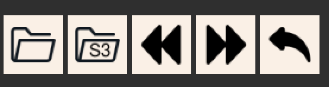

# Makannotations

Makannotations is an image annotation tool for creating mask annotations. It allows to draw masks of different shapes, assign (multi-level) labels to them, manipulate those masks, etc. It also provides a number of algorithms (CV and AI) for automatic mask detection. The app allows to open images either locally or from S3.

## Installation and set up

* Install required python packages:

  ```bash
  pip install -r requirements.txt
  ```

* Start the tool:

  ```bash
  ./makannotations
  ```

* Configuration of the tool:

  Use `.makannotations` file to configure the state of the app.

  * `layers` represent categories to annotate. They also support hierarchical structure. For example:

    ```json
    "layers": {
      "dog": {
        "corgi": {},
        "pitbull": {},
        "pug": {}
      },
      "cat": {}
    }
    ```

  * `colors` represent list of colors for categories.

  * `help-links` (optional) - list for url links with more information about categories (can be empty).

  * `s3_bucket_prefix` (optional) - aws s3 directory prefix.
  * `filesystem_label_prefix` (optional) - directory to store labels locally (when using s3_bucket_prefix).

## Functionality

Images are labeled using a combination of point and polygon annotations.

### Navigating

The controls:



* Open a directory
* Open a directory in S3
* Previous image
* Next image
* Undo

The same functionality if available through file and edit>undo menu.

Navigate between images:


### Annotating

Drawing controls:


The drawing controls allow to add mask using different shapes and approaches.

* Flood fill

* Brush (point annotations)

  A single point can be drawn to create a circular mask (of some radius). Select the brush icon, and click anywhere on the image.
  

* Mask eraser

  Similarly to brush, erases the mask in circular shapes.

* Poly line

  Create a poly line shape of a given thickness.

* Polygon

  Click on the mask to start drawing, then click to place next point of the polygon. When finished, click on the first point (within a circle) to complete the shape.

  

  This annotation mode gives high precision labeling:
  

* Polygon eraser

Brush size can be adjusted:


Layer controls:

Switching between layers:


Mask for some layer can be marked _certified_ or _hard example_.

### Automatically annotating

Algorithms menu:


Algorithm pane example:


Most of the algorithms require a few steps to complete, and they will be marked 1), 2), ... . Other algorithms will provide a number of adjustments.

The algorithms:

* DL automask
  1. Load a torchscript model.
  2. Select the channel.
  3. Run the DL model to generate a mask.
* LAB automask
  Calculates mask automatically based on LAB color palette and a channel of green.
* GrabCut
  1. Select a rectangle where to run GrabCut.
  2. Run GrabCut segmentation algorithm.
* Clustering
  1. Select a rectangle where to run Clustering.
  2. Select a Seed - pixels on the object to be segmented.
  3. Adjust number of clusters.
  4. Run clustering algorithm.
* Mask manipulation
  * Size of objects to remove - remove small islands of mask (adjust their size).
  * Closing iterations for clustering.
  * Dilation iterations - adjust dilation of the mask on the outer sides.
  * Erosion iterations - adjust erosion of the mask on the outer sides.
* Moving Masks
  Move mask from one layer to another. Will have to select a rectangle area to be moved to another layer from the current one.
* Filters
  Has filters for navigation between images. Will only navigate to an image when the filter conditions match.
  The player will add a shade for the frames that are skipped based on the appropriate filter (color coded).

For drawing rectangles, seeds, etc. for the algorithms, use Edit>Draw menu. Use Edit>Undo to undo these elements in particular.

### Adjusting display

Adjustments to the display do not impact the resulting mask and do not change the image, but only help during the annotation.

The controls:


In the following order:

* Brightness (of the image)
* Contrast (of the image)
* Hue (of the image)
* Mask opacity

Display controls:


* Show mask - whether to display the mask.
* Only mask - whether to display only the mask, without the image.
* All Layers Mode - display masks for all layers at once, in different colors.
* Show Depth.
* One Inch Grid - display a one-inch grid to help with understanding the scale of labelled objects.

The same controls are available through View menu.

Zooming:


Red border signifies it's not the end of the image - scroll more.


Information pane:

Information about zoom level, mouse position, and pixel values in RGB, HSV, LAB.


## Shortcuts

Navigating:

* `O`: open a folder
* `U`: open a folder from S3
* `P`: previous image
* `N`: next image
* `1..0`: switch to layer 1..10
* `Alt+1..0`: switch to layer 11..20
* `#` (host mode): download file
* `!` (host mode): upload file
* `Ctrl+F`: open finder

Drawing:

* `F`: flood fill
* `D`: brush drawer
* `E`: brush eraser
* `L`: poly line
* `C`: polygon
* `Shift+C`: polygon eraser
* `Shift+R`: rectangle
* `Shift+S`: seed
* `B`: brush zoom in
* `Shift+B`: brush zoom out

Adjusting:

* `J`: certify layer
* `Ctrl+H`: hard example

* `Ctrl+Z`: undo
* `Ctrl+R`: undo rectangle
* `Ctrl+S`: undo seed
* `Ctrl+M`: undo mask

Display:

* `Z`: show depth
* `G`: show grid
* `Ctrl++`: zoom in
* `Ctrl+-`: zoom out
* `B` (polygon mode): zoom in start circle.
* `Shift+B` (polygon mode): zoom out start circle.
* `Ctrl+Shift+S`: resize image to fit

## Other

* Open Setting (File menu)
  Open the setting for the app.
* View > Tips
  See some tips and shortcuts.
